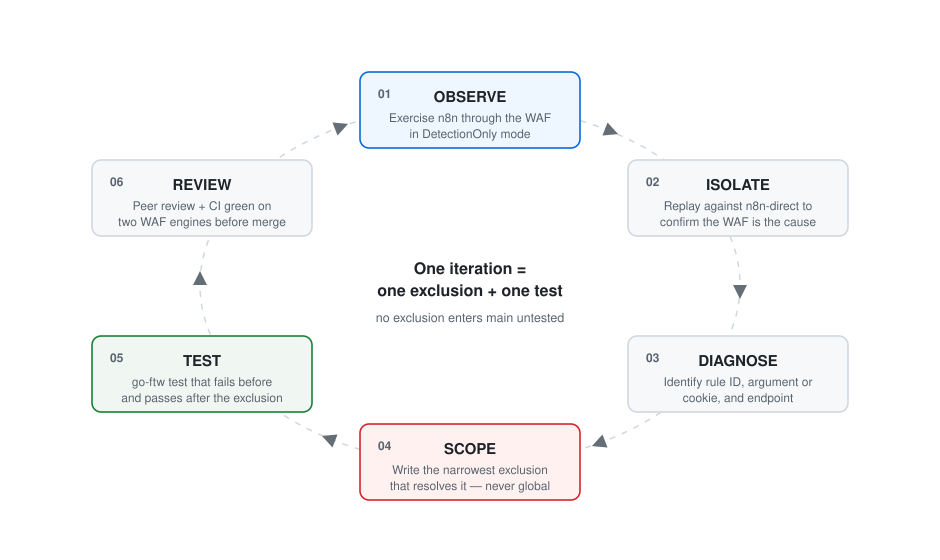

# An OWASP CRS Plugin for n8n

### Reto Winter 2026 — Universidad Católica del Uruguay

[](https://github.com/ucudal/reto-winter-2026-owasp-n8n-plugin/actions/workflows/lint.yml)
[](https://github.com/ucudal/reto-winter-2026-owasp-n8n-plugin/actions/workflows/integration.yml)
[](LICENSE)

This repository is the outcome of an undergraduate engineering challenge at
Universidad Católica del Uruguay (UCU). A cross-year student team was asked to
identify, reproduce and resolve the false positives that the OWASP Core Rule
Set produces when it is deployed in front of [n8n](https://n8n.io/), and to
package the result as a CRS plugin suitable for upstream contribution.

The deliverable is a working plugin — not a report about one. Everything in
this repository is intended to be reviewed, merged and used by the OWASP CRS
community under the same standards as any third-party contribution.

---

## 1. The challenge

### 1.1 What a *Reto* is

A **Reto** is UCU's project-based learning format. Students from different
years and degree programs are grouped into a single team and given one
open-ended, real-world problem, together with a fixed timeframe and an external
frame of reference — in this case, the contribution guidelines of an
established open-source project. There is no predefined solution and no
instructor-supplied dataset: the team is responsible for scoping the problem,
choosing a methodology, and producing an artifact that survives outside the
classroom.

The pedagogical intent is that the constraints be genuine. The team did not
"submit an assignment"; it had to satisfy a real maintainer community, an
existing rule ID namespace, a mandatory test format, and a CI pipeline that
fails loudly.

### 1.2 Problem statement

n8n is a workflow automation platform that is very commonly self-hosted, and
self-hosted deployments are frequently placed behind a reverse proxy running
ModSecurity with the OWASP Core Rule Set. At the time this Reto began, no CRS
plugin for n8n existed.

This matters because n8n's normal traffic is, structurally, indistinguishable
from an attack under a naive signature-based inspection:

- entire workflow graphs are serialized as JSON and sent to `/rest/workflows`;
- node parameters legitimately contain **user-authored JavaScript, SQL, and
  HTML**, including `<script>` tags;
- analytics cookies (PostHog, Google Analytics) carry embedded JSON and have
  **installation-specific names**;
- telemetry is proxied through n8n's own backend with base64-encoded payloads.

At paranoia level 2 with a default anomaly threshold, stock CRS breaks the
editor: saving a workflow, opening credentials, or refreshing the dashboard
triggers SQL injection, XSS and RFI rules on entirely legitimate requests. The
practical consequence is that operators disable CRS rules globally — trading
away real protection to keep the application usable.

### 1.3 Objectives

| # | Objective |
| --- | --- |
| O1 | Reproduce n8n's CRS false positives in a controlled, instrumented environment |
| O2 | Resolve each one with an exclusion **scoped as narrowly as possible**, never globally |
| O3 | Prove each exclusion with an automated regression test |
| O4 | Verify that no exclusion weakens detection of real attacks |
| O5 | Meet the CRS contribution guidelines so the work can be submitted upstream |

The binding constraint throughout was **O2**: an exclusion that disables a CRS
rule site-wide "fixes" the false positive while destroying the security value
of the rule. Every exclusion in this repository is scoped by request URI,
argument name, or cookie name.

---

## 2. Methodology

The team worked in an empirical loop rather than by reading n8n's source code.
Each iteration produced one exclusion and one test.

<p align="center">
  
</p>

### 2.1 Experimental setup

Findings were produced in a disposable containerized lab, not in this
repository. Its defining feature was an **A/B pair**: the same n8n version
exposed twice, once behind the WAF and once directly. Any behavior present in
the first and absent in the second is attributable to the WAF, which removes
the most common source of misdiagnosis — mistaking an application bug for a
false positive. ModSecurity audit logs were collected as JSON and indexed, so
each false positive could be traced to a specific rule ID, severity and matched
variable rather than inferred from a broken UI.

That scaffolding is deliberately **not** part of this repository: a CRS plugin
should contain rules and tests, nothing else. The reproducible artifact is the
regression suite in [`tests/regression/`](tests/regression), which is what
actually proves the exclusions behave as claimed.

### 2.2 Reference configuration

Findings are only meaningful relative to a stated configuration. All exclusions
in this repository were derived against:

| Parameter | Value |
| --- | --- |
| CRS version | 4.28.0 (nginx image), also tested against CRS `main` |
| Blocking / detection paranoia level | 2 |
| Inbound anomaly threshold | 5 |
| Outbound anomaly threshold | 4 |
| n8n version | 2.29.10 |

### 2.3 Validation strategy

Two independent gates run on every pull request:

1. **Lint** — the official `coreruleset/crs-plugin-test-action` linter checks
   rule ID range membership, duplicate IDs, and that every rule has a
   corresponding test.
2. **Integration** — the full go-ftw regression suite is executed against
   **Apache/mod_security2 and nginx/libmodsecurity3**, on both the pinned CRS
   release and CRS `main`. Running on two engines guards against exclusions
   that happen to work only under one implementation's parsing behavior.

Regression tests are predominantly **negative tests** (`no_expect_ids`): they
assert that a legitimate n8n request does *not* trigger a given CRS rule. This
is the correct form for an exclusions-only plugin — the property under test is
the absence of a false positive.

---

## 3. Results

| Metric | Value |
| --- | --- |
| False positives identified and resolved | 63 exclusion rules + 4 target updates |
| Regression test files | 33 |
| Individual test cases | 67 |
| Pull requests reviewed and merged | 52 |
| WAF engines validated against | 2 (Apache/mod_security2, nginx/libmodsecurity3) |
| Team members | 12 |
| Duration | July 2026 |

### 3.1 Taxonomy of false positives found

The false positives cluster into eight structural causes, which is itself a
finding: they are not scattered edge cases but consequences of a small number
of design decisions in n8n.

| # | Cause | n8n behavior | CRS rules triggered |
| --- | --- | --- | --- |
| A | Workflow serialization | Expressions, filters, conditions, dates and credential names inside workflow JSON | `930120`, `934200` |
| B | Code-as-data nodes | User-authored JavaScript (`jsCode`), disk paths (`fileSelector`) | `932130`, `930100`, `930110` |
| C | HTML templates | Workflows embedding `<script>`, `<meta>`, CSS, charset declarations | `941100`, `941110`, `941160`, `941190`, `941260`, `921130` |
| D | SQL-as-data nodes | Merge node in SQL Query mode | `942100` |
| E | Analytics cookies | `ph_phc_*_posthog` and `g_state` cookies carrying JSON, names varying per install | `942200`, `942290`, `942340`, `942370`, `942420`, `942421`, `942490` |
| F | Telemetry & feature flags | `/rest/ph/flags`, `/rest/telemetry/proxy/v1/`, base64 payloads | `932236`, `932260`, `934110`, `942120`, `942432`, `920420` |
| G | JSON query filters | Workflow and execution list filters passed as JSON in query arguments | `942330`, `942430` |
| H | PATCH semantics | Tag updates and partial workflow updates | `911100` |

Categories B and D are the conceptually interesting ones. n8n's purpose is to
let users write and store executable code; a WAF's purpose is to stop
executable code from reaching an application. The exclusion cannot be
"allow code" — it must be "allow code *in the specific fields where the
application's contract says code belongs*, on the specific endpoints that
accept it". That distinction is what makes these exclusions defensible rather
than a blanket disablement.

### 3.2 Limitations

Stated explicitly, as they bound the validity of the results:

- A different paranoia level or n8n version may surface false positives not covered here.
- The plugin was exercised through the n8n editor UI based on the NASA workflow. Programmatic use of the
  public API, community nodes and third-party integrations are not covered.
- Exclusions were derived empirically from observed traffic, not from an
  exhaustive enumeration of n8n's route map; absence of an exclusion is not
  evidence of absence of a false positive.
- The rule ID block is proposed, not yet confirmed by the CRS maintainers, so
  rule IDs may change before the upstream merge.

---

## 4. The plugin

### 4.1 Scope

The plugin is **exclusions-only**. It adds no new detection rules, introduces
no new blocking behavior, and does not lower the anomaly threshold. Its entire
function is to prevent stock CRS from firing on legitimate n8n traffic.

Per-rule rationale is documented in the comment above each rule; each rule
names the CRS rule IDs it addresses and the user-facing action that triggers
them.

The repository contains only what a CRS plugin needs — rules, tests, and the
machinery that validates them:

```
plugins/
  n8n-config.conf        plugin activation and vhost scoping
rules/
  REQUEST-900-EXCLUSION-RULES-BEFORE-CRS.conf    → n8n-before.conf
  RESPONSE-999-EXCLUSION-RULES-AFTER-CRS.conf    → n8n-after.conf
tests/
  regression/            one go-ftw YAML file per rule ID
  integration/           compose override for the CI test harness
.github/workflows/       lint + two-engine integration runs
```

### 4.2 Rule ID range

**9,530,000 – 9,530,999** (block base 9,530,000).

### 4.3 Requirements

- CRS version 4.0 or newer
- A ModSecurity-compatible WAF (ModSecurity v2, libmodsecurity3, or Coraza)
- n8n served behind a reverse proxy running that WAF

### 4.4 Installation

Copy the plugin files into the CRS `plugins/` directory:

```
plugins/n8n-config.conf
plugins/n8n-before.conf
plugins/n8n-after.conf
```

CRS loads them automatically in the following order:

```
Include crs/crs-setup.conf

Include crs/plugins/*-config.conf
Include crs/plugins/*-before.conf

Include crs/rules/*.conf

Include crs/plugins/*-after.conf
```

> **Note on the current layout.** While the plugin is being packaged for
> upstream, the rules live in this repository as
> `rules/REQUEST-900-EXCLUSION-RULES-BEFORE-CRS.conf` and
> `rules/RESPONSE-999-EXCLUSION-RULES-AFTER-CRS.conf`, mapping to
> `n8n-before.conf` and `n8n-after.conf` respectively. The CI workflow performs
> exactly this mapping before running the test suite, so what is validated is
> the plugin layout described above.

### 4.5 Configuration

`plugins/n8n-config.conf` holds the plugin's activation settings, following the
CRS convention. Both are shipped commented out, as CRS expects:

| Setting | Purpose |
| --- | --- |
| `tx.n8n-plugin_enabled` | Master on/off switch for the plugin |
| Host-header gate | Restricts the plugin to the vhost that serves n8n |

In shared deployments, enable the plugin only on the virtual host that actually
serves n8n rather than globally, so the exclusions cannot reach unrelated
applications running on the same CRS engine. `WebAppID` is the canonical
mechanism for this, but Coraza does not support it yet, so the config file uses
a `Host`-header gate instead.

> The exclusion rules do not yet read `tx.n8n-plugin_enabled`; wiring the
> toggle through to them is a known gap, tracked for the upstream submission.
> Until then, the plugin is disabled by removing its files from `plugins/`.

### 4.6 Recommended roll-out

1. Install the plugin and run CRS in **DetectionOnly** mode.
2. Exercise the editor: create and save a workflow, add Code / HTTP / Merge
   nodes, open credentials, browse executions, refresh the dashboard.
3. Review the audit log. Anything still firing is either a genuine detection or
   a false positive worth reporting (see [§6](#6-reporting-false-positives)).
4. Switch CRS back to blocking mode.

### 4.7 Running the tests locally

Requires Docker and [go-ftw](https://github.com/coreruleset/go-ftw):

```bash
# Assemble the plugin in the layout CRS expects
mkdir -p tests/runtime-plugins
cp -R plugins/. tests/runtime-plugins/
cp rules/REQUEST-900-EXCLUSION-RULES-BEFORE-CRS.conf tests/runtime-plugins/n8n-before.conf
cp rules/RESPONSE-999-EXCLUSION-RULES-AFTER-CRS.conf tests/runtime-plugins/n8n-after.conf

# Fetch the shared CRS test harness (not vendored in this repository)
curl -fsSL https://raw.githubusercontent.com/coreruleset/crs-plugin-test-action/main/tests/integration/docker-compose.yml \
  -o tests/integration/docker-compose.yml

docker compose -f tests/integration/docker-compose.yml \
               -f tests/integration/docker-compose.override.yml up -d nginx

ftw check -d tests/regression
ftw run   -d tests/regression --show-failures-only
```

## 5. Team

Twelve students from different years at Universidad Católica del
Uruguay contributed across 52 reviewed pull requests.

<table>
  <tr>
    <td align="center" width="140">
      <a href="https://github.com/MateoTonkovic"><br><sub><b>Mateo Tonkovic</b></sub></a><br><sub>@MateoTonkovic</sub>
    </td>
    <td align="center" width="140">
      <a href="https://github.com/FacundoPiriz17"><br><sub><b>Facundo Píriz</b></sub></a><br><sub>@FacundoPiriz17</sub>
    </td>
    <td align="center" width="140">
      <a href="https://github.com/eugeniaguibernau"><br><sub><b>Eugenia Guibernau</b></sub></a><br><sub>@eugeniaguibernau</sub>
    </td>
    <td align="center" width="140">
      <a href="https://github.com/LucasGiffuni"><br><sub><b>Lucas Giffuni</b></sub></a><br><sub>@LucasGiffuni</sub>
    </td>
    <td align="center" width="140">
      <a href="https://github.com/BenjaminRielli"><br><sub><b>Benjamín Rielli</b></sub></a><br><sub>@BenjaminRielli</sub>
    </td>
    <td align="center" width="140">
      <a href="https://github.com/Rodri240"><br><sub><b>Rodrigo Pereira</b></sub></a><br><sub>@Rodri240</sub>
    </td>
  </tr>
  <tr>
    <td align="center" width="140">
      <a href="https://github.com/ClaraPlateiro"><br><sub><b>Clara Plateiro</b></sub></a><br><sub>@ClaraPlateiro</sub>
    </td>
    <td align="center" width="140">
      <a href="https://github.com/mauromachadoc"><br><sub><b>Mauro Machado</b></sub></a><br><sub>@mauromachadoc</sub>
    </td>
    <td align="center" width="140">
      <a href="https://github.com/martinalaventure"><br><sub><b>Martina Laventure</b></sub></a><br><sub>@martinalaventure</sub>
    </td>
    <td align="center" width="140">
      <a href="https://github.com/JoseVarela8"><br><sub><b>José Varela</b></sub></a><br><sub>@JoseVarela8</sub>
    </td>
    <td align="center" width="140">
      <a href="https://github.com/francofil"><br><sub><b>Franco Filardi</b></sub></a><br><sub>@francofil</sub>
    </td>
    <td align="center" width="140">
      <a href="https://github.com/aparedes1998"><br><sub><b>Agustín Paredes</b></sub></a><br><sub>@aparedes1998</sub>
    </td>
  </tr>
</table>

Per-rule attribution is recorded in the `meta.author` field of each regression
test and in the commit history; see also [CONTRIBUTORS.md](CONTRIBUTORS.md) and
the [contributor graph](https://github.com/ucudal/reto-winter-2026-owasp-n8n-plugin/graphs/contributors).

The work was organized so that no exclusion entered `main` without a second
team member's review and a passing CI run on both WAF engines — the same bar a
third-party contribution to CRS has to clear.

### 5.1 Acknowledgements

This plugin is built on the [CRS template plugin](https://github.com/coreruleset/template-plugin)
by [Christian Folini](https://github.com/dune73) and
[Felipe Zipitría](https://github.com/fzipi), and on the testing and linting
tooling maintained by the OWASP CRS project.

---

## 6. Reporting false positives

The taxonomy in §3.1 is not claimed to be exhaustive. If you hit a false
positive with this plugin installed, please open an issue or a pull request
including:

- CRS version
- ModSecurity / Coraza version
- n8n version
- The ModSecurity audit log entry
- The action in n8n that caused it

Reports that include a reproducible request are the most useful, since they can
be turned directly into a regression test.

---

## 7. License

Apache License 2.0 — see [LICENSE](LICENSE). This matches the OWASP CRS
licensing so the plugin can be contributed upstream without a licensing
conflict.

## 8. References

- OWASP Core Rule Set — <https://coreruleset.org/>
- CRS plugin documentation — <https://coreruleset.org/docs/concepts/plugins/>
- CRS contribution guidelines — <https://github.com/coreruleset/coreruleset/blob/main/CONTRIBUTING.md>
- CRS plugin registry — <https://github.com/coreruleset/plugin-registry>
- CRS template plugin — <https://github.com/coreruleset/template-plugin>
- go-ftw test framework — <https://github.com/coreruleset/go-ftw>
- n8n — <https://github.com/n8n-io/n8n>
- Universidad Católica del Uruguay — <https://ucu.edu.uy/>
